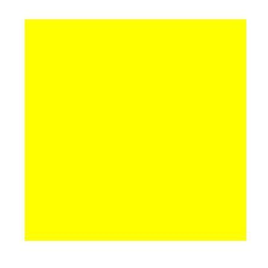
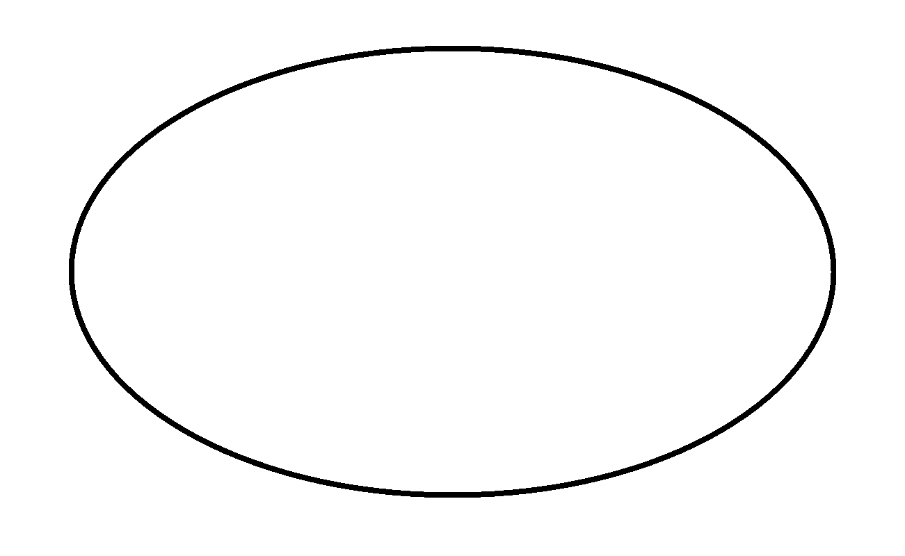

lab_4
----

**Задача:** Сегментация изображений – Level set метод

**Описание реализации:** Пользователь выбирает область, в которой точно присутствует объект. Результатом программы 
будет изображение с выделенным объектом.

**Время:**

| Изображение | Последовательно | OpenMP | TBB | MPI+OpneMP |
| ----------- |:---------------:|:------:|:---:|:----------:|
| Circle      | 0.013016        |        |     |            |
| Square      | 0.00932         |        |     |            |
| Ellipse     | 0.029837        |        |     |            |

**Изображения:**

#### Circle 600x600

#### Square 444x444

#### Ellipse 1301x800

