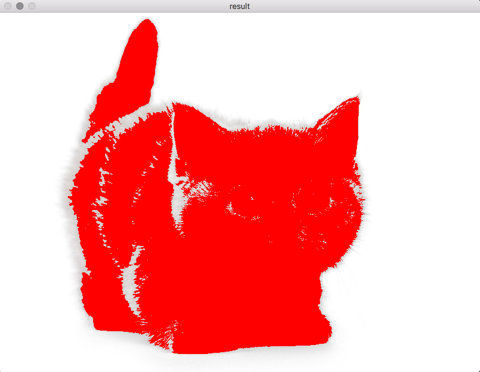

lab_4
----

**Задача:** Сегментация изображений – Level set метод

**Время:**

Эксперименты проводились на процессоре **AMD FX6300** (6 физических ядер).

Запуск на массиве из 200 млн элементов. Время указано в секундах.

| Библиотека      | 1 поток  | 2 потока | 4 потока | 6 потоков |
| --------------- |:--------:|:--------:|:--------:|:---------:|
| OpenMP          | 5.519    | 3.133    | 1.888    | 1.592     |
| Intel TBB       | 5.659    | 3.1      | 2.047    | 1.645     |
| MPI+OpenMP      |          |          |          |           |
|     1 процесс   | 5.924    | 3.058    | 2.128    | 1.744     |
|     2 процесса  | 3.132    | 2.171    | 1.875    | 1.895     |
|     4 процесса  | 2.184    | 1.937    | 2.021    | 1.942     |
|     6 процессов | 1.885    | 1.994    | 2.027    | 2.057     |

### Изображения

